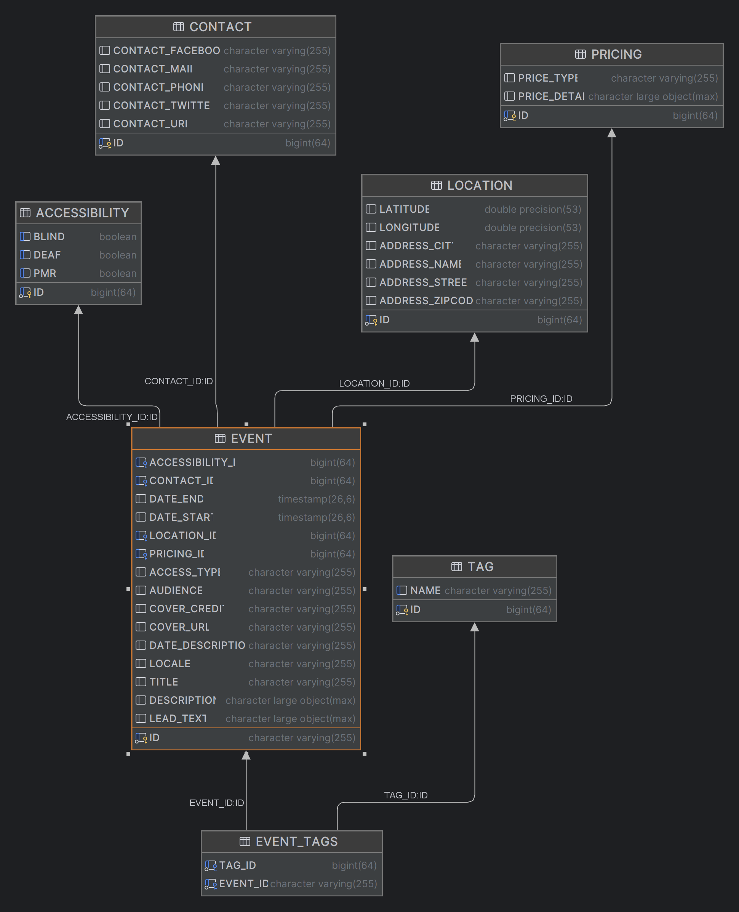

# que faire à Paris 
## Présentation de l'application
Cette application web permet de visualiser les événements en région parisienne à partir de données ouvertes (open data) fournies au format JSON, GeoJSON, et CSV. Elle utilise Spring Boot pour la gestion backend et inclut des fonctionnalités avancées telles que des API REST, l'intégration avec Hibernate pour la persistance des données, et GraphQL pour des recherches complexes.

L'objectif principal de l'application est de fournir une interface intuitive pour explorer et filtrer les événements culturels, artistiques, et sociaux, tout en affichant les informations pertinentes telles que la localisation, les contacts, et les informations d'accessibilité. L'architecture est pensée pour être flexible, scalable et maintenable, intégrant des pratiques modernes de développement comme les tests unitaires avec JUnit et Mockito.

## Diagramme de données

